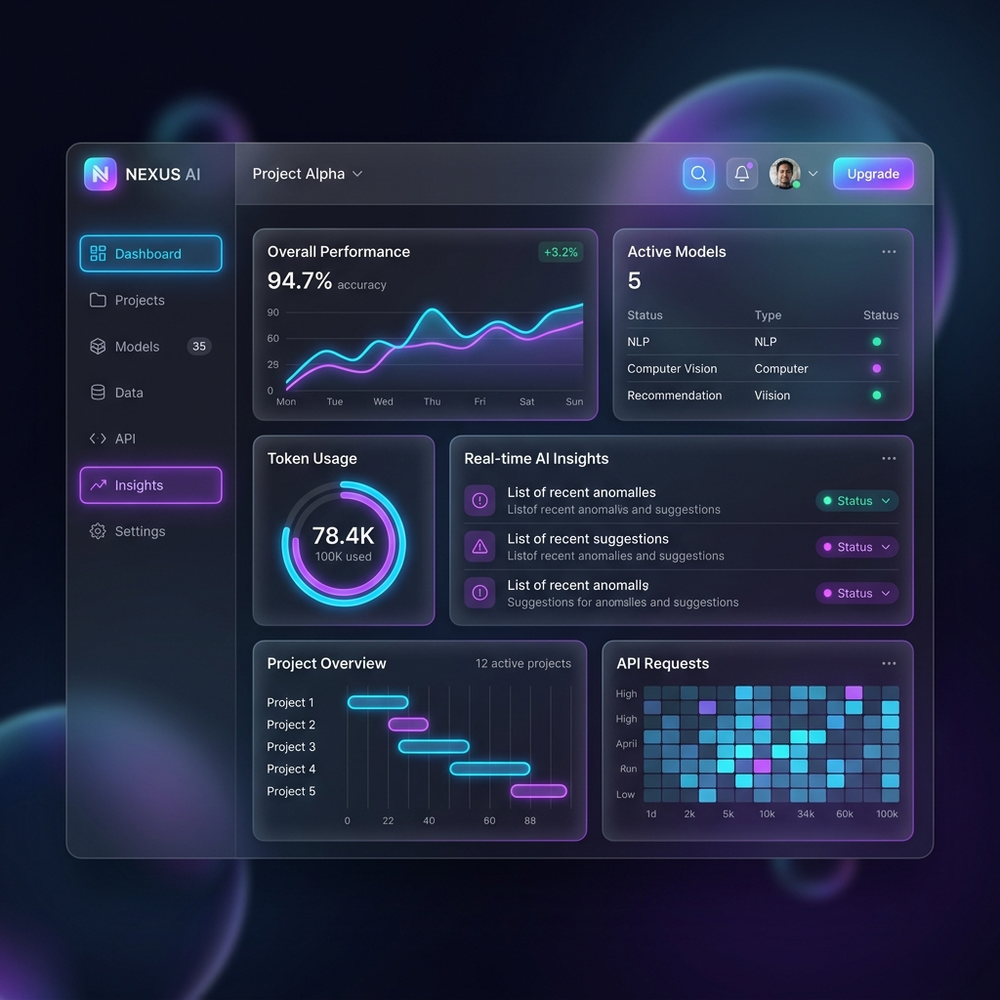

# ✨ AI.Gen - Premium Content Generation SaaS

A full-stack, highly polished SaaS application for generating AI-powered social media content and images. Built with modern web technologies, this project features a premium glassmorphism UI, user authentication, a simulated payment gateway, and real AI integration via OpenAI.



## 🌟 Features

- **Multi-Modal Generation**: Supports generating both highly engaging text and beautiful AI images.
- **Real OpenAI Integration**: Simply drop in your `OPENAI_API_KEY` to connect the platform to ChatGPT for real-time text generation.
- **Smart Fallback System**: If no API key is provided, the system seamlessly falls back to high-quality mock generation, ensuring the app is always functional for portfolio demonstrations.
- **Premium UI/UX**: Custom-built CSS Glassmorphism design with floating animated orbs, responsive layouts, and a modern typography stack (`Outfit` & `Inter`).
- **User Authentication**: Secure JWT-based login and registration system.
- **History Tracking**: All generated text and images are saved to a SQLite database and can be reviewed in the dashboard sidebar.
- **Monetization Ready**: Includes a simulated Stripe checkout modal for a realistic "Pro Tier" subscription flow.

## 🛠️ Technology Stack

**Frontend:**
- Vanilla JavaScript (ES6 Modules)
- Vite (Build Tool & Dev Server)
- Pure CSS3 (Glassmorphism & Keyframe Animations)

**Backend:**
- Python 3
- Flask (REST API)
- SQLAlchemy (ORM & SQLite Database)
- PyJWT (Authentication)
- Requests (OpenAI API integration)

---

## 🚀 Getting Started

Follow these steps to run the project locally.

### 1. Clone the repository
```bash
git clone https://github.com/yourusername/ai-saas.git
cd ai-saas
```

### 2. Setup the Backend (Flask)
```bash
cd backend

# Create a virtual environment (optional but recommended)
python -m venv venv
source venv/bin/activate # On Windows use: venv\Scripts\activate

# Install dependencies
pip install -r requirements.txt

# Configure Environment Variables
# Copy the example env file and add your OpenAI API key
copy .env.example .env
```
*Note: Edit `.env` and set your `OPENAI_API_KEY` if you want real AI generation.*

**Start the Flask Server:**
```bash
python main.py
# The server will run on http://127.0.0.1:8000
```

### 3. Setup the Frontend (Vite)
Open a new terminal window and navigate to the frontend directory:
```bash
cd frontend

# Install dependencies
npm install

# Start the Vite development server
npm run dev
# The frontend will run on http://127.0.0.1:5173
```

### 4. Experience the App
Open your browser and navigate to `http://127.0.0.1:5173`. 
Create a new account, claim your 100 free credits, and start generating!

## 🤝 Contributing
Contributions, issues, and feature requests are welcome! Feel free to check the issues page.

## 📝 License
This project is open-source and available under the [MIT License](LICENSE).
